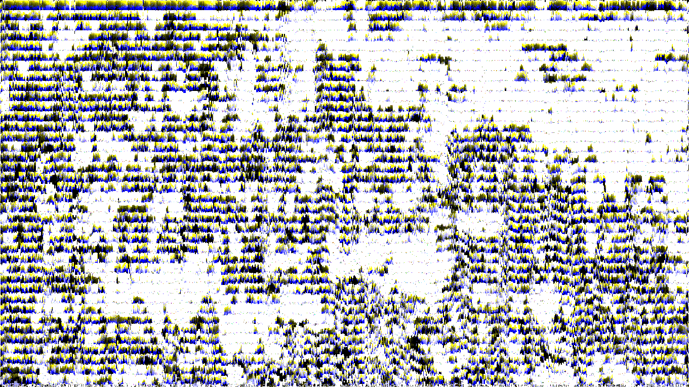

# FunnyName's Glitch Art Engine

A Python-based image manipulation software built using Pillow and Tkinter to create glitch art, pixel sorting, and various image effects.

## Features
### Feature	Description
Pixel Sorting : Sorts pixels in segments based on brightness thresholds.<br>
Chromatic Aberration : Simulates lens color fringing by shifting and sorting specific RGB channels.<br>
Edge-Detection Text : Procedurally places text along the high-contrast edges of an image.<br>
Binarization : Black and white conversion based on custom thresholds<br>
Cross-Brightness : Creates glowing cross artifacts on bright pixels. (Not implemented in gui yet)

## Installation

You need to have Python 3.8+ installed, then install the dependencies using :

```bash
pip install Pillow
pip install Tkinter
```

## Execution

The program allows you to queue multiple effects and execute them in sequence.

1. Load your image
2. Add your desired effects with your settings
3. Order them as you wish
4. Process the image and contemplate your artwork


## Fx pipeline logic (without GUI)

### 1. Load your image
```python
img = Image.open("input.png")
```
### 2. Initialize the processor 
```python
processor = ActionList(img)
```
### 3. Add your modifiers (Effect, *Args)
```python
processor.add(ImageModifier.binarize, 128) 
processor.add(ImageModifier.pixelSortBrightness, 100, 30)
processor.add(ImageModifier.chromaticAbberation, 150, 10, 0)
```
### 4. Execute and save
```python
processor.execute("final_result.png")
```
## Example

 

## How It Works

The engine uses Pillow (PIL) to access the image pixels directly. <br> 
Many algorithms in this program utilize a "Threshold + Segment" logic

## Project Structure
```
.
├── main.py                   # Main program with GUI
├── fxRegister.py             # Effects dictionnary
├── scripts/
│   ├── ImageModifier.py      # Core static methods for image manipulation
│   └── executionList.py      # Pipeline management & sequential processing
├── tests/
│   ├── ImageModifierTest.py  # Simple to use code sequence
└── img/                      # Source images and output directory
```
## Requirements

    Python 3.8+
    Tkinter
    Pillow (PIL)

## What's next ? 

  - Display temporary image that's deleted when closing the app
  - Add save button to save the image where the user want to
  - Fx chain presets
    
  - Restyle the app, maybe an original artistic direction
  - MORE FUNCTIONNALITIESSSSS
  - MORE GLITCHEEEESSSSSSSS
  - M̶͔͔̯̆̉̐̑͐͆̌O̶̡͇̫̲͇̖̯͐͌͋͐̍͗͗͗̌R̴͍̀͌͂͂̋̍̅͗̄̕Ȩ̷̡̛̼̩̜̪͕͙͖͈̺̅͂̓́͛̊͊̑̄͋̚ͅͅ ̵̱͙̙̑͌̎̇͠Ģ̵̡͚͍̞͓̭̘͈̩̬̩̪̄ͅL̵̡̢̨̧̻̥̜͎͙͔̦̘̦̔̀̎̌͒͆́̈̈͠͝ͅḬ̷̙̱̮͙̦̜͕̇̍̑͂̀͊͆̅̐̈́̕T̶̙̟̘̟̝͈̖̭̪̺̻͓͈̟̤̆͆̾̈́̈́̇̿̈̂́̆̍͆͘͠Ĉ̸̨̧̲̭͚͎͍̺̘͓̣͓͓̰̾͐̌̌͑̍̓̍̌̿̌̈́ͅH̶̡̤͉̄̑̉̍͊̽̅̍̆͐Ẹ̵̖͔̣͒͗̊̇̓̌̅̀̅̌̌͗̑̾͝S̵̢̧̨̩͈̦̭̰͖͝
    
## License

Distributed under the MIT License. See LICENSE for more information.
